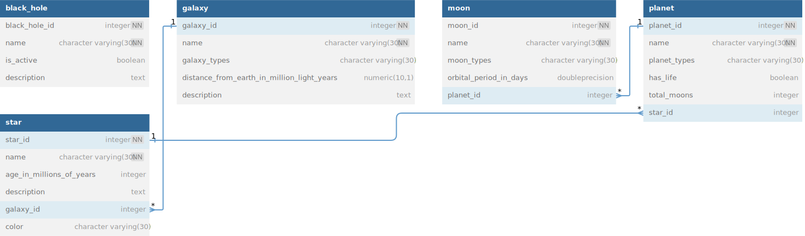

# Celestial Bodies Database

This project is part of the [Relational Database](https://www.freecodecamp.org/learn/relational-database/) training from **freeCodeCamp**. It is a celestial bodies database built using `PostgreSQL` and manipulated exclusively through the **command line**.

This project was created following a set of instructions. If you wish to see the detailed instructions, they are available in the [Project Instructions](project-instructions.md) file.

## TL;DR Instructions

```
1. Create database and connect to it.
2. Create tables as per required conditions.
3. Fill the tables as per required data conditions.
4. Assign Primary Key and Foreign Key as per instructions.
5. Compact all queries into a `universe.sql` file.
```

## Database Diagram

Here is a visual diagram of the database structure:




## How to Use

To use this database, you will need PostgreSQL installed on your machine and familiarity with the command line. Once PostgreSQL is set up, you can execute SQL queries to fetch, insert, update, or delete data.

## Project Completion

This project has been successfully completed and passed all tests. Here is the proof of completion:


## Contributing

Contributions to this project are welcome! If you find an error or have a suggestion to improve the database, feel free to open an issue or submit a pull request.